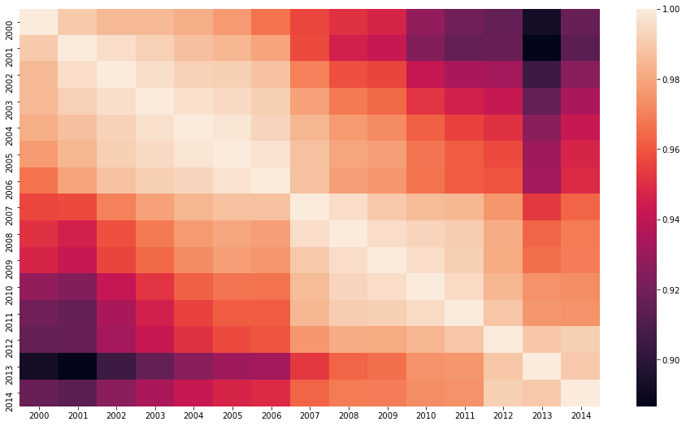
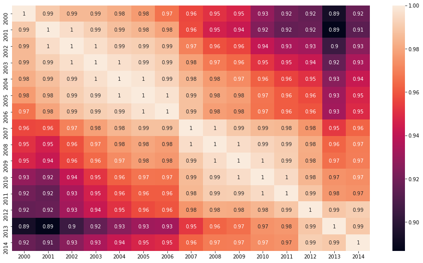
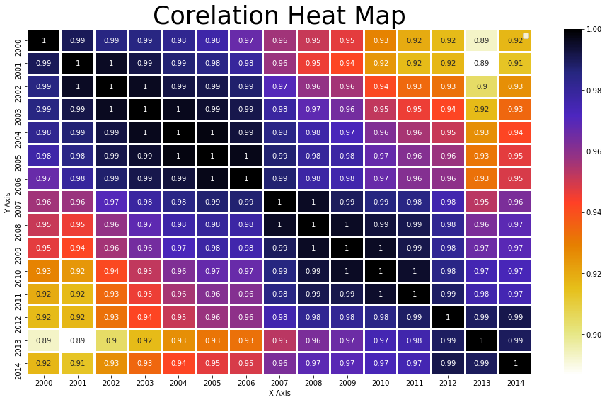
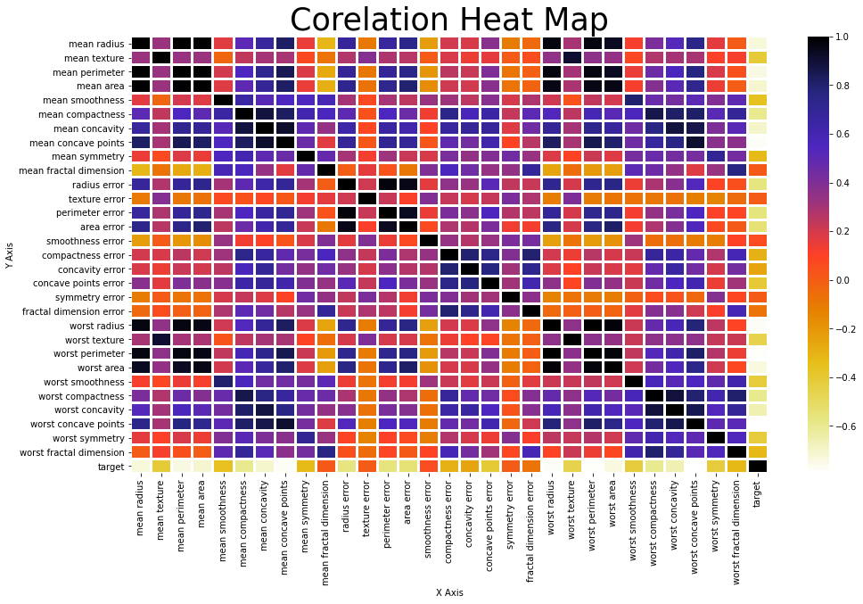
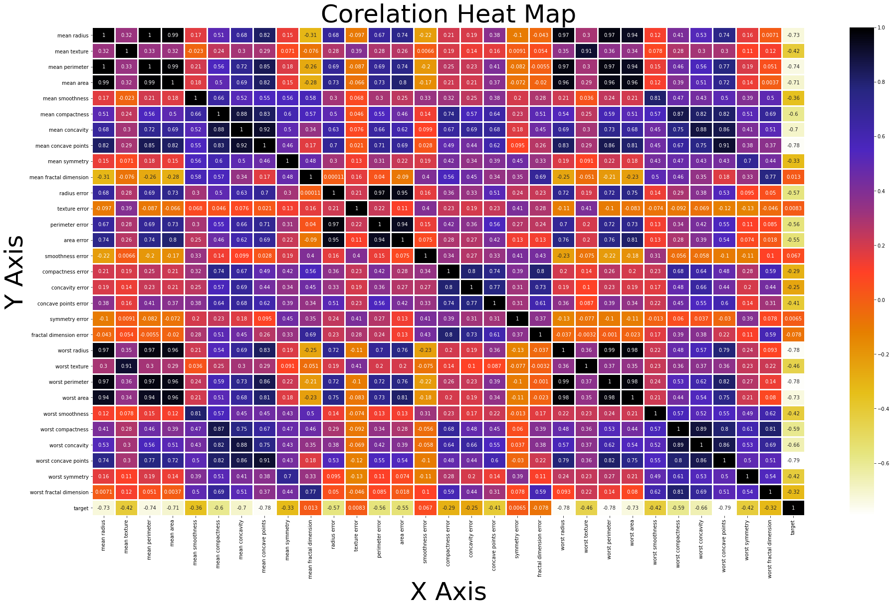

<h1 style="text-align:center; font-size:160%; font-family:verdana;color:#F44A79;"><em>Date 26-06-2021</em></h1>

<h1 style="text-align:center; font-size:360%; font-family:verdana;color:#4A3E76;"><em>Advance Seaborn HeatMap</em></h1>


```python
import matplotlib.pyplot as plt
import seaborn as sns
import pandas as pd
import numpy as np
from sklearn.datasets import load_breast_cancer # You will need a internet connection to do so
dataset_breast_cancer = load_breast_cancer() 
```


```python
dataset_global_warming=pd.read_csv("dataset_who_is_responsible_for_global_warming.csv")
dataset_global_warming
```


<div>
<style scoped>
    .dataframe tbody tr th:only-of-type {
        vertical-align: middle;
    }

    .dataframe tbody tr th {
        vertical-align: top;
    }

    .dataframe thead th {
        text-align: right;
    }
</style>
<table border="1" class="dataframe">
  <thead>
    <tr style="text-align: right;">
      <th></th>
      <th>Country Name</th>
      <th>Country Code</th>
      <th>Indicator Name</th>
      <th>Indicator Code</th>
      <th>2000</th>
      <th>2001</th>
      <th>2002</th>
      <th>2003</th>
      <th>2004</th>
      <th>2005</th>
      <th>2006</th>
      <th>2007</th>
      <th>2008</th>
      <th>2009</th>
      <th>2010</th>
      <th>2011</th>
      <th>2012</th>
      <th>2013</th>
      <th>2014</th>
    </tr>
  </thead>
  <tbody>
    <tr>
      <th>0</th>
      <td>Aruba</td>
      <td>ABW</td>
      <td>CO2 emissions (metric tons per capita)</td>
      <td>EN.ATM.CO2E.PC</td>
      <td>26.194875</td>
      <td>25.934024</td>
      <td>25.671162</td>
      <td>26.420452</td>
      <td>26.517293</td>
      <td>27.200708</td>
      <td>26.948260</td>
      <td>27.895574</td>
      <td>26.230847</td>
      <td>25.915833</td>
      <td>24.670529</td>
      <td>24.505835</td>
      <td>13.155542</td>
      <td>8.351294</td>
      <td>8.408363</td>
    </tr>
    <tr>
      <th>1</th>
      <td>Afghanistan</td>
      <td>AFG</td>
      <td>CO2 emissions (metric tons per capita)</td>
      <td>EN.ATM.CO2E.PC</td>
      <td>0.038506</td>
      <td>0.039002</td>
      <td>0.048716</td>
      <td>0.051830</td>
      <td>0.039378</td>
      <td>0.052948</td>
      <td>0.063728</td>
      <td>0.085418</td>
      <td>0.154101</td>
      <td>0.241723</td>
      <td>0.293837</td>
      <td>0.412017</td>
      <td>0.350371</td>
      <td>0.315602</td>
      <td>0.299445</td>
    </tr>
    <tr>
      <th>2</th>
      <td>Angola</td>
      <td>AGO</td>
      <td>CO2 emissions (metric tons per capita)</td>
      <td>EN.ATM.CO2E.PC</td>
      <td>0.580353</td>
      <td>0.573047</td>
      <td>0.720769</td>
      <td>0.497975</td>
      <td>0.996165</td>
      <td>0.979740</td>
      <td>1.098884</td>
      <td>1.197844</td>
      <td>1.181527</td>
      <td>1.232495</td>
      <td>1.243406</td>
      <td>1.252789</td>
      <td>1.330843</td>
      <td>1.254617</td>
      <td>1.291328</td>
    </tr>
    <tr>
      <th>3</th>
      <td>Albania</td>
      <td>ALB</td>
      <td>CO2 emissions (metric tons per capita)</td>
      <td>EN.ATM.CO2E.PC</td>
      <td>0.978175</td>
      <td>1.053304</td>
      <td>1.229541</td>
      <td>1.412697</td>
      <td>1.376213</td>
      <td>1.412498</td>
      <td>1.302576</td>
      <td>1.322335</td>
      <td>1.484311</td>
      <td>1.495600</td>
      <td>1.578574</td>
      <td>1.803715</td>
      <td>1.692908</td>
      <td>1.749211</td>
      <td>1.978763</td>
    </tr>
    <tr>
      <th>4</th>
      <td>Arab World</td>
      <td>ARB</td>
      <td>CO2 emissions (metric tons per capita)</td>
      <td>EN.ATM.CO2E.PC</td>
      <td>3.684441</td>
      <td>3.590303</td>
      <td>3.588036</td>
      <td>3.779889</td>
      <td>4.051465</td>
      <td>4.168486</td>
      <td>4.268240</td>
      <td>4.100226</td>
      <td>4.390401</td>
      <td>4.542151</td>
      <td>4.615758</td>
      <td>4.537755</td>
      <td>4.813631</td>
      <td>4.650474</td>
      <td>4.860234</td>
    </tr>
    <tr>
      <th>...</th>
      <td>...</td>
      <td>...</td>
      <td>...</td>
      <td>...</td>
      <td>...</td>
      <td>...</td>
      <td>...</td>
      <td>...</td>
      <td>...</td>
      <td>...</td>
      <td>...</td>
      <td>...</td>
      <td>...</td>
      <td>...</td>
      <td>...</td>
      <td>...</td>
      <td>...</td>
      <td>...</td>
      <td>...</td>
    </tr>
    <tr>
      <th>236</th>
      <td>Samoa</td>
      <td>WSM</td>
      <td>CO2 emissions (metric tons per capita)</td>
      <td>EN.ATM.CO2E.PC</td>
      <td>0.819042</td>
      <td>0.835469</td>
      <td>0.830662</td>
      <td>0.866893</td>
      <td>0.840956</td>
      <td>0.896731</td>
      <td>0.911212</td>
      <td>0.945487</td>
      <td>0.979060</td>
      <td>1.011854</td>
      <td>1.004361</td>
      <td>1.074708</td>
      <td>1.046640</td>
      <td>1.038064</td>
      <td>1.029788</td>
    </tr>
    <tr>
      <th>237</th>
      <td>Yemen</td>
      <td>YEM</td>
      <td>CO2 emissions (metric tons per capita)</td>
      <td>EN.ATM.CO2E.PC</td>
      <td>0.819164</td>
      <td>0.881350</td>
      <td>0.833251</td>
      <td>0.889143</td>
      <td>0.943264</td>
      <td>0.973808</td>
      <td>1.007360</td>
      <td>0.964139</td>
      <td>0.999238</td>
      <td>1.069059</td>
      <td>0.992602</td>
      <td>0.810900</td>
      <td>0.749447</td>
      <td>0.996885</td>
      <td>0.864835</td>
    </tr>
    <tr>
      <th>238</th>
      <td>South Africa</td>
      <td>ZAF</td>
      <td>CO2 emissions (metric tons per capita)</td>
      <td>EN.ATM.CO2E.PC</td>
      <td>8.280765</td>
      <td>8.020756</td>
      <td>7.583814</td>
      <td>8.488351</td>
      <td>9.330796</td>
      <td>8.539756</td>
      <td>9.073200</td>
      <td>9.352665</td>
      <td>9.854219</td>
      <td>9.870597</td>
      <td>9.190699</td>
      <td>9.004033</td>
      <td>8.845033</td>
      <td>8.673963</td>
      <td>8.980119</td>
    </tr>
    <tr>
      <th>239</th>
      <td>Zambia</td>
      <td>ZMB</td>
      <td>CO2 emissions (metric tons per capita)</td>
      <td>EN.ATM.CO2E.PC</td>
      <td>0.173057</td>
      <td>0.176166</td>
      <td>0.178397</td>
      <td>0.184923</td>
      <td>0.182854</td>
      <td>0.189859</td>
      <td>0.185076</td>
      <td>0.151567</td>
      <td>0.165936</td>
      <td>0.186396</td>
      <td>0.194337</td>
      <td>0.205911</td>
      <td>0.249457</td>
      <td>0.261113</td>
      <td>0.288271</td>
    </tr>
    <tr>
      <th>240</th>
      <td>Zimbabwe</td>
      <td>ZWE</td>
      <td>CO2 emissions (metric tons per capita)</td>
      <td>EN.ATM.CO2E.PC</td>
      <td>1.139201</td>
      <td>1.018598</td>
      <td>0.957193</td>
      <td>0.843469</td>
      <td>0.742440</td>
      <td>0.832299</td>
      <td>0.796028</td>
      <td>0.741658</td>
      <td>0.573101</td>
      <td>0.405716</td>
      <td>0.552146</td>
      <td>0.664751</td>
      <td>0.529703</td>
      <td>0.775564</td>
      <td>0.779956</td>
    </tr>
  </tbody>
</table>
<p>241 rows × 19 columns</p>
</div>


```python
dataset_global_warming=dataset_global_warming.drop(['Country Code','Indicator Name','Indicator Code'],axis=1).set_index('Country Name')
dataset_global_warming
```


<div>
<style scoped>
    .dataframe tbody tr th:only-of-type {
        vertical-align: middle;
    }

    .dataframe tbody tr th {
        vertical-align: top;
    }

    .dataframe thead th {
        text-align: right;
    }
</style>
<table border="1" class="dataframe">
  <thead>
    <tr style="text-align: right;">
      <th></th>
      <th>2000</th>
      <th>2001</th>
      <th>2002</th>
      <th>2003</th>
      <th>2004</th>
      <th>2005</th>
      <th>2006</th>
      <th>2007</th>
      <th>2008</th>
      <th>2009</th>
      <th>2010</th>
      <th>2011</th>
      <th>2012</th>
      <th>2013</th>
      <th>2014</th>
    </tr>
    <tr>
      <th>Country Name</th>
      <th></th>
      <th></th>
      <th></th>
      <th></th>
      <th></th>
      <th></th>
      <th></th>
      <th></th>
      <th></th>
      <th></th>
      <th></th>
      <th></th>
      <th></th>
      <th></th>
      <th></th>
    </tr>
  </thead>
  <tbody>
    <tr>
      <th>Aruba</th>
      <td>26.194875</td>
      <td>25.934024</td>
      <td>25.671162</td>
      <td>26.420452</td>
      <td>26.517293</td>
      <td>27.200708</td>
      <td>26.948260</td>
      <td>27.895574</td>
      <td>26.230847</td>
      <td>25.915833</td>
      <td>24.670529</td>
      <td>24.505835</td>
      <td>13.155542</td>
      <td>8.351294</td>
      <td>8.408363</td>
    </tr>
    <tr>
      <th>Afghanistan</th>
      <td>0.038506</td>
      <td>0.039002</td>
      <td>0.048716</td>
      <td>0.051830</td>
      <td>0.039378</td>
      <td>0.052948</td>
      <td>0.063728</td>
      <td>0.085418</td>
      <td>0.154101</td>
      <td>0.241723</td>
      <td>0.293837</td>
      <td>0.412017</td>
      <td>0.350371</td>
      <td>0.315602</td>
      <td>0.299445</td>
    </tr>
    <tr>
      <th>Angola</th>
      <td>0.580353</td>
      <td>0.573047</td>
      <td>0.720769</td>
      <td>0.497975</td>
      <td>0.996165</td>
      <td>0.979740</td>
      <td>1.098884</td>
      <td>1.197844</td>
      <td>1.181527</td>
      <td>1.232495</td>
      <td>1.243406</td>
      <td>1.252789</td>
      <td>1.330843</td>
      <td>1.254617</td>
      <td>1.291328</td>
    </tr>
    <tr>
      <th>Albania</th>
      <td>0.978175</td>
      <td>1.053304</td>
      <td>1.229541</td>
      <td>1.412697</td>
      <td>1.376213</td>
      <td>1.412498</td>
      <td>1.302576</td>
      <td>1.322335</td>
      <td>1.484311</td>
      <td>1.495600</td>
      <td>1.578574</td>
      <td>1.803715</td>
      <td>1.692908</td>
      <td>1.749211</td>
      <td>1.978763</td>
    </tr>
    <tr>
      <th>Arab World</th>
      <td>3.684441</td>
      <td>3.590303</td>
      <td>3.588036</td>
      <td>3.779889</td>
      <td>4.051465</td>
      <td>4.168486</td>
      <td>4.268240</td>
      <td>4.100226</td>
      <td>4.390401</td>
      <td>4.542151</td>
      <td>4.615758</td>
      <td>4.537755</td>
      <td>4.813631</td>
      <td>4.650474</td>
      <td>4.860234</td>
    </tr>
    <tr>
      <th>...</th>
      <td>...</td>
      <td>...</td>
      <td>...</td>
      <td>...</td>
      <td>...</td>
      <td>...</td>
      <td>...</td>
      <td>...</td>
      <td>...</td>
      <td>...</td>
      <td>...</td>
      <td>...</td>
      <td>...</td>
      <td>...</td>
      <td>...</td>
    </tr>
    <tr>
      <th>Samoa</th>
      <td>0.819042</td>
      <td>0.835469</td>
      <td>0.830662</td>
      <td>0.866893</td>
      <td>0.840956</td>
      <td>0.896731</td>
      <td>0.911212</td>
      <td>0.945487</td>
      <td>0.979060</td>
      <td>1.011854</td>
      <td>1.004361</td>
      <td>1.074708</td>
      <td>1.046640</td>
      <td>1.038064</td>
      <td>1.029788</td>
    </tr>
    <tr>
      <th>Yemen</th>
      <td>0.819164</td>
      <td>0.881350</td>
      <td>0.833251</td>
      <td>0.889143</td>
      <td>0.943264</td>
      <td>0.973808</td>
      <td>1.007360</td>
      <td>0.964139</td>
      <td>0.999238</td>
      <td>1.069059</td>
      <td>0.992602</td>
      <td>0.810900</td>
      <td>0.749447</td>
      <td>0.996885</td>
      <td>0.864835</td>
    </tr>
    <tr>
      <th>South Africa</th>
      <td>8.280765</td>
      <td>8.020756</td>
      <td>7.583814</td>
      <td>8.488351</td>
      <td>9.330796</td>
      <td>8.539756</td>
      <td>9.073200</td>
      <td>9.352665</td>
      <td>9.854219</td>
      <td>9.870597</td>
      <td>9.190699</td>
      <td>9.004033</td>
      <td>8.845033</td>
      <td>8.673963</td>
      <td>8.980119</td>
    </tr>
    <tr>
      <th>Zambia</th>
      <td>0.173057</td>
      <td>0.176166</td>
      <td>0.178397</td>
      <td>0.184923</td>
      <td>0.182854</td>
      <td>0.189859</td>
      <td>0.185076</td>
      <td>0.151567</td>
      <td>0.165936</td>
      <td>0.186396</td>
      <td>0.194337</td>
      <td>0.205911</td>
      <td>0.249457</td>
      <td>0.261113</td>
      <td>0.288271</td>
    </tr>
    <tr>
      <th>Zimbabwe</th>
      <td>1.139201</td>
      <td>1.018598</td>
      <td>0.957193</td>
      <td>0.843469</td>
      <td>0.742440</td>
      <td>0.832299</td>
      <td>0.796028</td>
      <td>0.741658</td>
      <td>0.573101</td>
      <td>0.405716</td>
      <td>0.552146</td>
      <td>0.664751</td>
      <td>0.529703</td>
      <td>0.775564</td>
      <td>0.779956</td>
    </tr>
  </tbody>
</table>
<p>241 rows × 15 columns</p>
</div>


```python
dataset_global_warming_corelation=dataset_global_warming.corr()
```


```python
plt.figure(figsize=(16,9))
sns.heatmap(dataset_global_warming_corelation)
```


    <AxesSubplot:>


    

    


```python
plt.figure(figsize=(16,9))
sns.heatmap(dataset_global_warming_corelation, annot = True)
```


    <AxesSubplot:>


    

    


```python
plt.figure(figsize=(16,9))
sns.heatmap(dataset_global_warming_corelation, annot = True,cmap='CMRmap_r',lw=2)
plt.title('Corelation Heat Map',size = 35)
plt.xlabel('X Axis')
plt.ylabel('Y Axis')
plt.legend()
```

    No handles with labels found to put in legend.
    


    <matplotlib.legend.Legend at 0x1e3c1e84910>


    

    


```python
dataset_breast_cancer
```


    {'data': array([[1.799e+01, 1.038e+01, 1.228e+02, ..., 2.654e-01, 4.601e-01,
             1.189e-01],
            [2.057e+01, 1.777e+01, 1.329e+02, ..., 1.860e-01, 2.750e-01,
             8.902e-02],
            [1.969e+01, 2.125e+01, 1.300e+02, ..., 2.430e-01, 3.613e-01,
             8.758e-02],
            ...,
            [1.660e+01, 2.808e+01, 1.083e+02, ..., 1.418e-01, 2.218e-01,
             7.820e-02],
            [2.060e+01, 2.933e+01, 1.401e+02, ..., 2.650e-01, 4.087e-01,
             1.240e-01],
            [7.760e+00, 2.454e+01, 4.792e+01, ..., 0.000e+00, 2.871e-01,
             7.039e-02]]),
     'target': array([0, 0, 0, 0, 0, 0, 0, 0, 0, 0, 0, 0, 0, 0, 0, 0, 0, 0, 0, 1, 1, 1,
            0, 0, 0, 0, 0, 0, 0, 0, 0, 0, 0, 0, 0, 0, 0, 1, 0, 0, 0, 0, 0, 0,
            0, 0, 1, 0, 1, 1, 1, 1, 1, 0, 0, 1, 0, 0, 1, 1, 1, 1, 0, 1, 0, 0,
            1, 1, 1, 1, 0, 1, 0, 0, 1, 0, 1, 0, 0, 1, 1, 1, 0, 0, 1, 0, 0, 0,
            1, 1, 1, 0, 1, 1, 0, 0, 1, 1, 1, 0, 0, 1, 1, 1, 1, 0, 1, 1, 0, 1,
            1, 1, 1, 1, 1, 1, 1, 0, 0, 0, 1, 0, 0, 1, 1, 1, 0, 0, 1, 0, 1, 0,
            0, 1, 0, 0, 1, 1, 0, 1, 1, 0, 1, 1, 1, 1, 0, 1, 1, 1, 1, 1, 1, 1,
            1, 1, 0, 1, 1, 1, 1, 0, 0, 1, 0, 1, 1, 0, 0, 1, 1, 0, 0, 1, 1, 1,
            1, 0, 1, 1, 0, 0, 0, 1, 0, 1, 0, 1, 1, 1, 0, 1, 1, 0, 0, 1, 0, 0,
            0, 0, 1, 0, 0, 0, 1, 0, 1, 0, 1, 1, 0, 1, 0, 0, 0, 0, 1, 1, 0, 0,
            1, 1, 1, 0, 1, 1, 1, 1, 1, 0, 0, 1, 1, 0, 1, 1, 0, 0, 1, 0, 1, 1,
            1, 1, 0, 1, 1, 1, 1, 1, 0, 1, 0, 0, 0, 0, 0, 0, 0, 0, 0, 0, 0, 0,
            0, 0, 1, 1, 1, 1, 1, 1, 0, 1, 0, 1, 1, 0, 1, 1, 0, 1, 0, 0, 1, 1,
            1, 1, 1, 1, 1, 1, 1, 1, 1, 1, 1, 0, 1, 1, 0, 1, 0, 1, 1, 1, 1, 1,
            1, 1, 1, 1, 1, 1, 1, 1, 1, 0, 1, 1, 1, 0, 1, 0, 1, 1, 1, 1, 0, 0,
            0, 1, 1, 1, 1, 0, 1, 0, 1, 0, 1, 1, 1, 0, 1, 1, 1, 1, 1, 1, 1, 0,
            0, 0, 1, 1, 1, 1, 1, 1, 1, 1, 1, 1, 1, 0, 0, 1, 0, 0, 0, 1, 0, 0,
            1, 1, 1, 1, 1, 0, 1, 1, 1, 1, 1, 0, 1, 1, 1, 0, 1, 1, 0, 0, 1, 1,
            1, 1, 1, 1, 0, 1, 1, 1, 1, 1, 1, 1, 0, 1, 1, 1, 1, 1, 0, 1, 1, 0,
            1, 1, 1, 1, 1, 1, 1, 1, 1, 1, 1, 1, 0, 1, 0, 0, 1, 0, 1, 1, 1, 1,
            1, 0, 1, 1, 0, 1, 0, 1, 1, 0, 1, 0, 1, 1, 1, 1, 1, 1, 1, 1, 0, 0,
            1, 1, 1, 1, 1, 1, 0, 1, 1, 1, 1, 1, 1, 1, 1, 1, 1, 0, 1, 1, 1, 1,
            1, 1, 1, 0, 1, 0, 1, 1, 0, 1, 1, 1, 1, 1, 0, 0, 1, 0, 1, 0, 1, 1,
            1, 1, 1, 0, 1, 1, 0, 1, 0, 1, 0, 0, 1, 1, 1, 0, 1, 1, 1, 1, 1, 1,
            1, 1, 1, 1, 1, 0, 1, 0, 0, 1, 1, 1, 1, 1, 1, 1, 1, 1, 1, 1, 1, 1,
            1, 1, 1, 1, 1, 1, 1, 1, 1, 1, 1, 1, 0, 0, 0, 0, 0, 0, 1]),
     'frame': None,
     'target_names': array(['malignant', 'benign'], dtype='<U9'),
     'DESCR': '.. _breast_cancer_dataset:\n\nBreast cancer wisconsin (diagnostic) dataset\n--------------------------------------------\n\n**Data Set Characteristics:**\n\n    :Number of Instances: 569\n\n    :Number of Attributes: 30 numeric, predictive attributes and the class\n\n    :Attribute Information:\n        - radius (mean of distances from center to points on the perimeter)\n        - texture (standard deviation of gray-scale values)\n        - perimeter\n        - area\n        - smoothness (local variation in radius lengths)\n        - compactness (perimeter^2 / area - 1.0)\n        - concavity (severity of concave portions of the contour)\n        - concave points (number of concave portions of the contour)\n        - symmetry\n        - fractal dimension ("coastline approximation" - 1)\n\n        The mean, standard error, and "worst" or largest (mean of the three\n        worst/largest values) of these features were computed for each image,\n        resulting in 30 features.  For instance, field 0 is Mean Radius, field\n        10 is Radius SE, field 20 is Worst Radius.\n\n        - class:\n                - WDBC-Malignant\n                - WDBC-Benign\n\n    :Summary Statistics:\n\n    ===================================== ====== ======\n                                           Min    Max\n    ===================================== ====== ======\n    radius (mean):                        6.981  28.11\n    texture (mean):                       9.71   39.28\n    perimeter (mean):                     43.79  188.5\n    area (mean):                          143.5  2501.0\n    smoothness (mean):                    0.053  0.163\n    compactness (mean):                   0.019  0.345\n    concavity (mean):                     0.0    0.427\n    concave points (mean):                0.0    0.201\n    symmetry (mean):                      0.106  0.304\n    fractal dimension (mean):             0.05   0.097\n    radius (standard error):              0.112  2.873\n    texture (standard error):             0.36   4.885\n    perimeter (standard error):           0.757  21.98\n    area (standard error):                6.802  542.2\n    smoothness (standard error):          0.002  0.031\n    compactness (standard error):         0.002  0.135\n    concavity (standard error):           0.0    0.396\n    concave points (standard error):      0.0    0.053\n    symmetry (standard error):            0.008  0.079\n    fractal dimension (standard error):   0.001  0.03\n    radius (worst):                       7.93   36.04\n    texture (worst):                      12.02  49.54\n    perimeter (worst):                    50.41  251.2\n    area (worst):                         185.2  4254.0\n    smoothness (worst):                   0.071  0.223\n    compactness (worst):                  0.027  1.058\n    concavity (worst):                    0.0    1.252\n    concave points (worst):               0.0    0.291\n    symmetry (worst):                     0.156  0.664\n    fractal dimension (worst):            0.055  0.208\n    ===================================== ====== ======\n\n    :Missing Attribute Values: None\n\n    :Class Distribution: 212 - Malignant, 357 - Benign\n\n    :Creator:  Dr. William H. Wolberg, W. Nick Street, Olvi L. Mangasarian\n\n    :Donor: Nick Street\n\n    :Date: November, 1995\n\nThis is a copy of UCI ML Breast Cancer Wisconsin (Diagnostic) datasets.\nhttps://goo.gl/U2Uwz2\n\nFeatures are computed from a digitized image of a fine needle\naspirate (FNA) of a breast mass.  They describe\ncharacteristics of the cell nuclei present in the image.\n\nSeparating plane described above was obtained using\nMultisurface Method-Tree (MSM-T) [K. P. Bennett, "Decision Tree\nConstruction Via Linear Programming." Proceedings of the 4th\nMidwest Artificial Intelligence and Cognitive Science Society,\npp. 97-101, 1992], a classification method which uses linear\nprogramming to construct a decision tree.  Relevant features\nwere selected using an exhaustive search in the space of 1-4\nfeatures and 1-3 separating planes.\n\nThe actual linear program used to obtain the separating plane\nin the 3-dimensional space is that described in:\n[K. P. Bennett and O. L. Mangasarian: "Robust Linear\nProgramming Discrimination of Two Linearly Inseparable Sets",\nOptimization Methods and Software 1, 1992, 23-34].\n\nThis database is also available through the UW CS ftp server:\n\nftp ftp.cs.wisc.edu\ncd math-prog/cpo-dataset/machine-learn/WDBC/\n\n.. topic:: References\n\n   - W.N. Street, W.H. Wolberg and O.L. Mangasarian. Nuclear feature extraction \n     for breast tumor diagnosis. IS&T/SPIE 1993 International Symposium on \n     Electronic Imaging: Science and Technology, volume 1905, pages 861-870,\n     San Jose, CA, 1993.\n   - O.L. Mangasarian, W.N. Street and W.H. Wolberg. Breast cancer diagnosis and \n     prognosis via linear programming. Operations Research, 43(4), pages 570-577, \n     July-August 1995.\n   - W.H. Wolberg, W.N. Street, and O.L. Mangasarian. Machine learning techniques\n     to diagnose breast cancer from fine-needle aspirates. Cancer Letters 77 (1994) \n     163-171.',
     'feature_names': array(['mean radius', 'mean texture', 'mean perimeter', 'mean area',
            'mean smoothness', 'mean compactness', 'mean concavity',
            'mean concave points', 'mean symmetry', 'mean fractal dimension',
            'radius error', 'texture error', 'perimeter error', 'area error',
            'smoothness error', 'compactness error', 'concavity error',
            'concave points error', 'symmetry error',
            'fractal dimension error', 'worst radius', 'worst texture',
            'worst perimeter', 'worst area', 'worst smoothness',
            'worst compactness', 'worst concavity', 'worst concave points',
            'worst symmetry', 'worst fractal dimension'], dtype='<U23'),
     'filename': 'C:\\Users\\amanr\\anaconda3\\lib\\site-packages\\sklearn\\datasets\\data\\breast_cancer.csv'}


```python
dataset_breast_cancer_data_frame=pd.DataFrame(np.c_[dataset_breast_cancer['data'],dataset_breast_cancer['target']])
dataset_breast_cancer_data_frame
```


<div>
<style scoped>
    .dataframe tbody tr th:only-of-type {
        vertical-align: middle;
    }

    .dataframe tbody tr th {
        vertical-align: top;
    }

    .dataframe thead th {
        text-align: right;
    }
</style>
<table border="1" class="dataframe">
  <thead>
    <tr style="text-align: right;">
      <th></th>
      <th>0</th>
      <th>1</th>
      <th>2</th>
      <th>3</th>
      <th>4</th>
      <th>5</th>
      <th>6</th>
      <th>7</th>
      <th>8</th>
      <th>9</th>
      <th>...</th>
      <th>21</th>
      <th>22</th>
      <th>23</th>
      <th>24</th>
      <th>25</th>
      <th>26</th>
      <th>27</th>
      <th>28</th>
      <th>29</th>
      <th>30</th>
    </tr>
  </thead>
  <tbody>
    <tr>
      <th>0</th>
      <td>17.99</td>
      <td>10.38</td>
      <td>122.80</td>
      <td>1001.0</td>
      <td>0.11840</td>
      <td>0.27760</td>
      <td>0.30010</td>
      <td>0.14710</td>
      <td>0.2419</td>
      <td>0.07871</td>
      <td>...</td>
      <td>17.33</td>
      <td>184.60</td>
      <td>2019.0</td>
      <td>0.16220</td>
      <td>0.66560</td>
      <td>0.7119</td>
      <td>0.2654</td>
      <td>0.4601</td>
      <td>0.11890</td>
      <td>0.0</td>
    </tr>
    <tr>
      <th>1</th>
      <td>20.57</td>
      <td>17.77</td>
      <td>132.90</td>
      <td>1326.0</td>
      <td>0.08474</td>
      <td>0.07864</td>
      <td>0.08690</td>
      <td>0.07017</td>
      <td>0.1812</td>
      <td>0.05667</td>
      <td>...</td>
      <td>23.41</td>
      <td>158.80</td>
      <td>1956.0</td>
      <td>0.12380</td>
      <td>0.18660</td>
      <td>0.2416</td>
      <td>0.1860</td>
      <td>0.2750</td>
      <td>0.08902</td>
      <td>0.0</td>
    </tr>
    <tr>
      <th>2</th>
      <td>19.69</td>
      <td>21.25</td>
      <td>130.00</td>
      <td>1203.0</td>
      <td>0.10960</td>
      <td>0.15990</td>
      <td>0.19740</td>
      <td>0.12790</td>
      <td>0.2069</td>
      <td>0.05999</td>
      <td>...</td>
      <td>25.53</td>
      <td>152.50</td>
      <td>1709.0</td>
      <td>0.14440</td>
      <td>0.42450</td>
      <td>0.4504</td>
      <td>0.2430</td>
      <td>0.3613</td>
      <td>0.08758</td>
      <td>0.0</td>
    </tr>
    <tr>
      <th>3</th>
      <td>11.42</td>
      <td>20.38</td>
      <td>77.58</td>
      <td>386.1</td>
      <td>0.14250</td>
      <td>0.28390</td>
      <td>0.24140</td>
      <td>0.10520</td>
      <td>0.2597</td>
      <td>0.09744</td>
      <td>...</td>
      <td>26.50</td>
      <td>98.87</td>
      <td>567.7</td>
      <td>0.20980</td>
      <td>0.86630</td>
      <td>0.6869</td>
      <td>0.2575</td>
      <td>0.6638</td>
      <td>0.17300</td>
      <td>0.0</td>
    </tr>
    <tr>
      <th>4</th>
      <td>20.29</td>
      <td>14.34</td>
      <td>135.10</td>
      <td>1297.0</td>
      <td>0.10030</td>
      <td>0.13280</td>
      <td>0.19800</td>
      <td>0.10430</td>
      <td>0.1809</td>
      <td>0.05883</td>
      <td>...</td>
      <td>16.67</td>
      <td>152.20</td>
      <td>1575.0</td>
      <td>0.13740</td>
      <td>0.20500</td>
      <td>0.4000</td>
      <td>0.1625</td>
      <td>0.2364</td>
      <td>0.07678</td>
      <td>0.0</td>
    </tr>
    <tr>
      <th>...</th>
      <td>...</td>
      <td>...</td>
      <td>...</td>
      <td>...</td>
      <td>...</td>
      <td>...</td>
      <td>...</td>
      <td>...</td>
      <td>...</td>
      <td>...</td>
      <td>...</td>
      <td>...</td>
      <td>...</td>
      <td>...</td>
      <td>...</td>
      <td>...</td>
      <td>...</td>
      <td>...</td>
      <td>...</td>
      <td>...</td>
      <td>...</td>
    </tr>
    <tr>
      <th>564</th>
      <td>21.56</td>
      <td>22.39</td>
      <td>142.00</td>
      <td>1479.0</td>
      <td>0.11100</td>
      <td>0.11590</td>
      <td>0.24390</td>
      <td>0.13890</td>
      <td>0.1726</td>
      <td>0.05623</td>
      <td>...</td>
      <td>26.40</td>
      <td>166.10</td>
      <td>2027.0</td>
      <td>0.14100</td>
      <td>0.21130</td>
      <td>0.4107</td>
      <td>0.2216</td>
      <td>0.2060</td>
      <td>0.07115</td>
      <td>0.0</td>
    </tr>
    <tr>
      <th>565</th>
      <td>20.13</td>
      <td>28.25</td>
      <td>131.20</td>
      <td>1261.0</td>
      <td>0.09780</td>
      <td>0.10340</td>
      <td>0.14400</td>
      <td>0.09791</td>
      <td>0.1752</td>
      <td>0.05533</td>
      <td>...</td>
      <td>38.25</td>
      <td>155.00</td>
      <td>1731.0</td>
      <td>0.11660</td>
      <td>0.19220</td>
      <td>0.3215</td>
      <td>0.1628</td>
      <td>0.2572</td>
      <td>0.06637</td>
      <td>0.0</td>
    </tr>
    <tr>
      <th>566</th>
      <td>16.60</td>
      <td>28.08</td>
      <td>108.30</td>
      <td>858.1</td>
      <td>0.08455</td>
      <td>0.10230</td>
      <td>0.09251</td>
      <td>0.05302</td>
      <td>0.1590</td>
      <td>0.05648</td>
      <td>...</td>
      <td>34.12</td>
      <td>126.70</td>
      <td>1124.0</td>
      <td>0.11390</td>
      <td>0.30940</td>
      <td>0.3403</td>
      <td>0.1418</td>
      <td>0.2218</td>
      <td>0.07820</td>
      <td>0.0</td>
    </tr>
    <tr>
      <th>567</th>
      <td>20.60</td>
      <td>29.33</td>
      <td>140.10</td>
      <td>1265.0</td>
      <td>0.11780</td>
      <td>0.27700</td>
      <td>0.35140</td>
      <td>0.15200</td>
      <td>0.2397</td>
      <td>0.07016</td>
      <td>...</td>
      <td>39.42</td>
      <td>184.60</td>
      <td>1821.0</td>
      <td>0.16500</td>
      <td>0.86810</td>
      <td>0.9387</td>
      <td>0.2650</td>
      <td>0.4087</td>
      <td>0.12400</td>
      <td>0.0</td>
    </tr>
    <tr>
      <th>568</th>
      <td>7.76</td>
      <td>24.54</td>
      <td>47.92</td>
      <td>181.0</td>
      <td>0.05263</td>
      <td>0.04362</td>
      <td>0.00000</td>
      <td>0.00000</td>
      <td>0.1587</td>
      <td>0.05884</td>
      <td>...</td>
      <td>30.37</td>
      <td>59.16</td>
      <td>268.6</td>
      <td>0.08996</td>
      <td>0.06444</td>
      <td>0.0000</td>
      <td>0.0000</td>
      <td>0.2871</td>
      <td>0.07039</td>
      <td>1.0</td>
    </tr>
  </tbody>
</table>
<p>569 rows × 31 columns</p>
</div>


```python
dataset_breast_cancer_data_frame=pd.DataFrame(np.c_[dataset_breast_cancer['data'],dataset_breast_cancer['target']],
                                              columns=np.append(dataset_breast_cancer['feature_names'],['target']))
dataset_breast_cancer_data_frame
```


<div>
<style scoped>
    .dataframe tbody tr th:only-of-type {
        vertical-align: middle;
    }

    .dataframe tbody tr th {
        vertical-align: top;
    }

    .dataframe thead th {
        text-align: right;
    }
</style>
<table border="1" class="dataframe">
  <thead>
    <tr style="text-align: right;">
      <th></th>
      <th>mean radius</th>
      <th>mean texture</th>
      <th>mean perimeter</th>
      <th>mean area</th>
      <th>mean smoothness</th>
      <th>mean compactness</th>
      <th>mean concavity</th>
      <th>mean concave points</th>
      <th>mean symmetry</th>
      <th>mean fractal dimension</th>
      <th>...</th>
      <th>worst texture</th>
      <th>worst perimeter</th>
      <th>worst area</th>
      <th>worst smoothness</th>
      <th>worst compactness</th>
      <th>worst concavity</th>
      <th>worst concave points</th>
      <th>worst symmetry</th>
      <th>worst fractal dimension</th>
      <th>target</th>
    </tr>
  </thead>
  <tbody>
    <tr>
      <th>0</th>
      <td>17.99</td>
      <td>10.38</td>
      <td>122.80</td>
      <td>1001.0</td>
      <td>0.11840</td>
      <td>0.27760</td>
      <td>0.30010</td>
      <td>0.14710</td>
      <td>0.2419</td>
      <td>0.07871</td>
      <td>...</td>
      <td>17.33</td>
      <td>184.60</td>
      <td>2019.0</td>
      <td>0.16220</td>
      <td>0.66560</td>
      <td>0.7119</td>
      <td>0.2654</td>
      <td>0.4601</td>
      <td>0.11890</td>
      <td>0.0</td>
    </tr>
    <tr>
      <th>1</th>
      <td>20.57</td>
      <td>17.77</td>
      <td>132.90</td>
      <td>1326.0</td>
      <td>0.08474</td>
      <td>0.07864</td>
      <td>0.08690</td>
      <td>0.07017</td>
      <td>0.1812</td>
      <td>0.05667</td>
      <td>...</td>
      <td>23.41</td>
      <td>158.80</td>
      <td>1956.0</td>
      <td>0.12380</td>
      <td>0.18660</td>
      <td>0.2416</td>
      <td>0.1860</td>
      <td>0.2750</td>
      <td>0.08902</td>
      <td>0.0</td>
    </tr>
    <tr>
      <th>2</th>
      <td>19.69</td>
      <td>21.25</td>
      <td>130.00</td>
      <td>1203.0</td>
      <td>0.10960</td>
      <td>0.15990</td>
      <td>0.19740</td>
      <td>0.12790</td>
      <td>0.2069</td>
      <td>0.05999</td>
      <td>...</td>
      <td>25.53</td>
      <td>152.50</td>
      <td>1709.0</td>
      <td>0.14440</td>
      <td>0.42450</td>
      <td>0.4504</td>
      <td>0.2430</td>
      <td>0.3613</td>
      <td>0.08758</td>
      <td>0.0</td>
    </tr>
    <tr>
      <th>3</th>
      <td>11.42</td>
      <td>20.38</td>
      <td>77.58</td>
      <td>386.1</td>
      <td>0.14250</td>
      <td>0.28390</td>
      <td>0.24140</td>
      <td>0.10520</td>
      <td>0.2597</td>
      <td>0.09744</td>
      <td>...</td>
      <td>26.50</td>
      <td>98.87</td>
      <td>567.7</td>
      <td>0.20980</td>
      <td>0.86630</td>
      <td>0.6869</td>
      <td>0.2575</td>
      <td>0.6638</td>
      <td>0.17300</td>
      <td>0.0</td>
    </tr>
    <tr>
      <th>4</th>
      <td>20.29</td>
      <td>14.34</td>
      <td>135.10</td>
      <td>1297.0</td>
      <td>0.10030</td>
      <td>0.13280</td>
      <td>0.19800</td>
      <td>0.10430</td>
      <td>0.1809</td>
      <td>0.05883</td>
      <td>...</td>
      <td>16.67</td>
      <td>152.20</td>
      <td>1575.0</td>
      <td>0.13740</td>
      <td>0.20500</td>
      <td>0.4000</td>
      <td>0.1625</td>
      <td>0.2364</td>
      <td>0.07678</td>
      <td>0.0</td>
    </tr>
    <tr>
      <th>...</th>
      <td>...</td>
      <td>...</td>
      <td>...</td>
      <td>...</td>
      <td>...</td>
      <td>...</td>
      <td>...</td>
      <td>...</td>
      <td>...</td>
      <td>...</td>
      <td>...</td>
      <td>...</td>
      <td>...</td>
      <td>...</td>
      <td>...</td>
      <td>...</td>
      <td>...</td>
      <td>...</td>
      <td>...</td>
      <td>...</td>
      <td>...</td>
    </tr>
    <tr>
      <th>564</th>
      <td>21.56</td>
      <td>22.39</td>
      <td>142.00</td>
      <td>1479.0</td>
      <td>0.11100</td>
      <td>0.11590</td>
      <td>0.24390</td>
      <td>0.13890</td>
      <td>0.1726</td>
      <td>0.05623</td>
      <td>...</td>
      <td>26.40</td>
      <td>166.10</td>
      <td>2027.0</td>
      <td>0.14100</td>
      <td>0.21130</td>
      <td>0.4107</td>
      <td>0.2216</td>
      <td>0.2060</td>
      <td>0.07115</td>
      <td>0.0</td>
    </tr>
    <tr>
      <th>565</th>
      <td>20.13</td>
      <td>28.25</td>
      <td>131.20</td>
      <td>1261.0</td>
      <td>0.09780</td>
      <td>0.10340</td>
      <td>0.14400</td>
      <td>0.09791</td>
      <td>0.1752</td>
      <td>0.05533</td>
      <td>...</td>
      <td>38.25</td>
      <td>155.00</td>
      <td>1731.0</td>
      <td>0.11660</td>
      <td>0.19220</td>
      <td>0.3215</td>
      <td>0.1628</td>
      <td>0.2572</td>
      <td>0.06637</td>
      <td>0.0</td>
    </tr>
    <tr>
      <th>566</th>
      <td>16.60</td>
      <td>28.08</td>
      <td>108.30</td>
      <td>858.1</td>
      <td>0.08455</td>
      <td>0.10230</td>
      <td>0.09251</td>
      <td>0.05302</td>
      <td>0.1590</td>
      <td>0.05648</td>
      <td>...</td>
      <td>34.12</td>
      <td>126.70</td>
      <td>1124.0</td>
      <td>0.11390</td>
      <td>0.30940</td>
      <td>0.3403</td>
      <td>0.1418</td>
      <td>0.2218</td>
      <td>0.07820</td>
      <td>0.0</td>
    </tr>
    <tr>
      <th>567</th>
      <td>20.60</td>
      <td>29.33</td>
      <td>140.10</td>
      <td>1265.0</td>
      <td>0.11780</td>
      <td>0.27700</td>
      <td>0.35140</td>
      <td>0.15200</td>
      <td>0.2397</td>
      <td>0.07016</td>
      <td>...</td>
      <td>39.42</td>
      <td>184.60</td>
      <td>1821.0</td>
      <td>0.16500</td>
      <td>0.86810</td>
      <td>0.9387</td>
      <td>0.2650</td>
      <td>0.4087</td>
      <td>0.12400</td>
      <td>0.0</td>
    </tr>
    <tr>
      <th>568</th>
      <td>7.76</td>
      <td>24.54</td>
      <td>47.92</td>
      <td>181.0</td>
      <td>0.05263</td>
      <td>0.04362</td>
      <td>0.00000</td>
      <td>0.00000</td>
      <td>0.1587</td>
      <td>0.05884</td>
      <td>...</td>
      <td>30.37</td>
      <td>59.16</td>
      <td>268.6</td>
      <td>0.08996</td>
      <td>0.06444</td>
      <td>0.0000</td>
      <td>0.0000</td>
      <td>0.2871</td>
      <td>0.07039</td>
      <td>1.0</td>
    </tr>
  </tbody>
</table>
<p>569 rows × 31 columns</p>
</div>


```python
dataset_breast_cancer_data_frame_corelation=dataset_breast_cancer_data_frame.corr()
dataset_breast_cancer_data_frame_corelation
```


<div>
<style scoped>
    .dataframe tbody tr th:only-of-type {
        vertical-align: middle;
    }

    .dataframe tbody tr th {
        vertical-align: top;
    }

    .dataframe thead th {
        text-align: right;
    }
</style>
<table border="1" class="dataframe">
  <thead>
    <tr style="text-align: right;">
      <th></th>
      <th>mean radius</th>
      <th>mean texture</th>
      <th>mean perimeter</th>
      <th>mean area</th>
      <th>mean smoothness</th>
      <th>mean compactness</th>
      <th>mean concavity</th>
      <th>mean concave points</th>
      <th>mean symmetry</th>
      <th>mean fractal dimension</th>
      <th>...</th>
      <th>worst texture</th>
      <th>worst perimeter</th>
      <th>worst area</th>
      <th>worst smoothness</th>
      <th>worst compactness</th>
      <th>worst concavity</th>
      <th>worst concave points</th>
      <th>worst symmetry</th>
      <th>worst fractal dimension</th>
      <th>target</th>
    </tr>
  </thead>
  <tbody>
    <tr>
      <th>mean radius</th>
      <td>1.000000</td>
      <td>0.323782</td>
      <td>0.997855</td>
      <td>0.987357</td>
      <td>0.170581</td>
      <td>0.506124</td>
      <td>0.676764</td>
      <td>0.822529</td>
      <td>0.147741</td>
      <td>-0.311631</td>
      <td>...</td>
      <td>0.297008</td>
      <td>0.965137</td>
      <td>0.941082</td>
      <td>0.119616</td>
      <td>0.413463</td>
      <td>0.526911</td>
      <td>0.744214</td>
      <td>0.163953</td>
      <td>0.007066</td>
      <td>-0.730029</td>
    </tr>
    <tr>
      <th>mean texture</th>
      <td>0.323782</td>
      <td>1.000000</td>
      <td>0.329533</td>
      <td>0.321086</td>
      <td>-0.023389</td>
      <td>0.236702</td>
      <td>0.302418</td>
      <td>0.293464</td>
      <td>0.071401</td>
      <td>-0.076437</td>
      <td>...</td>
      <td>0.912045</td>
      <td>0.358040</td>
      <td>0.343546</td>
      <td>0.077503</td>
      <td>0.277830</td>
      <td>0.301025</td>
      <td>0.295316</td>
      <td>0.105008</td>
      <td>0.119205</td>
      <td>-0.415185</td>
    </tr>
    <tr>
      <th>mean perimeter</th>
      <td>0.997855</td>
      <td>0.329533</td>
      <td>1.000000</td>
      <td>0.986507</td>
      <td>0.207278</td>
      <td>0.556936</td>
      <td>0.716136</td>
      <td>0.850977</td>
      <td>0.183027</td>
      <td>-0.261477</td>
      <td>...</td>
      <td>0.303038</td>
      <td>0.970387</td>
      <td>0.941550</td>
      <td>0.150549</td>
      <td>0.455774</td>
      <td>0.563879</td>
      <td>0.771241</td>
      <td>0.189115</td>
      <td>0.051019</td>
      <td>-0.742636</td>
    </tr>
    <tr>
      <th>mean area</th>
      <td>0.987357</td>
      <td>0.321086</td>
      <td>0.986507</td>
      <td>1.000000</td>
      <td>0.177028</td>
      <td>0.498502</td>
      <td>0.685983</td>
      <td>0.823269</td>
      <td>0.151293</td>
      <td>-0.283110</td>
      <td>...</td>
      <td>0.287489</td>
      <td>0.959120</td>
      <td>0.959213</td>
      <td>0.123523</td>
      <td>0.390410</td>
      <td>0.512606</td>
      <td>0.722017</td>
      <td>0.143570</td>
      <td>0.003738</td>
      <td>-0.708984</td>
    </tr>
    <tr>
      <th>mean smoothness</th>
      <td>0.170581</td>
      <td>-0.023389</td>
      <td>0.207278</td>
      <td>0.177028</td>
      <td>1.000000</td>
      <td>0.659123</td>
      <td>0.521984</td>
      <td>0.553695</td>
      <td>0.557775</td>
      <td>0.584792</td>
      <td>...</td>
      <td>0.036072</td>
      <td>0.238853</td>
      <td>0.206718</td>
      <td>0.805324</td>
      <td>0.472468</td>
      <td>0.434926</td>
      <td>0.503053</td>
      <td>0.394309</td>
      <td>0.499316</td>
      <td>-0.358560</td>
    </tr>
    <tr>
      <th>mean compactness</th>
      <td>0.506124</td>
      <td>0.236702</td>
      <td>0.556936</td>
      <td>0.498502</td>
      <td>0.659123</td>
      <td>1.000000</td>
      <td>0.883121</td>
      <td>0.831135</td>
      <td>0.602641</td>
      <td>0.565369</td>
      <td>...</td>
      <td>0.248133</td>
      <td>0.590210</td>
      <td>0.509604</td>
      <td>0.565541</td>
      <td>0.865809</td>
      <td>0.816275</td>
      <td>0.815573</td>
      <td>0.510223</td>
      <td>0.687382</td>
      <td>-0.596534</td>
    </tr>
    <tr>
      <th>mean concavity</th>
      <td>0.676764</td>
      <td>0.302418</td>
      <td>0.716136</td>
      <td>0.685983</td>
      <td>0.521984</td>
      <td>0.883121</td>
      <td>1.000000</td>
      <td>0.921391</td>
      <td>0.500667</td>
      <td>0.336783</td>
      <td>...</td>
      <td>0.299879</td>
      <td>0.729565</td>
      <td>0.675987</td>
      <td>0.448822</td>
      <td>0.754968</td>
      <td>0.884103</td>
      <td>0.861323</td>
      <td>0.409464</td>
      <td>0.514930</td>
      <td>-0.696360</td>
    </tr>
    <tr>
      <th>mean concave points</th>
      <td>0.822529</td>
      <td>0.293464</td>
      <td>0.850977</td>
      <td>0.823269</td>
      <td>0.553695</td>
      <td>0.831135</td>
      <td>0.921391</td>
      <td>1.000000</td>
      <td>0.462497</td>
      <td>0.166917</td>
      <td>...</td>
      <td>0.292752</td>
      <td>0.855923</td>
      <td>0.809630</td>
      <td>0.452753</td>
      <td>0.667454</td>
      <td>0.752399</td>
      <td>0.910155</td>
      <td>0.375744</td>
      <td>0.368661</td>
      <td>-0.776614</td>
    </tr>
    <tr>
      <th>mean symmetry</th>
      <td>0.147741</td>
      <td>0.071401</td>
      <td>0.183027</td>
      <td>0.151293</td>
      <td>0.557775</td>
      <td>0.602641</td>
      <td>0.500667</td>
      <td>0.462497</td>
      <td>1.000000</td>
      <td>0.479921</td>
      <td>...</td>
      <td>0.090651</td>
      <td>0.219169</td>
      <td>0.177193</td>
      <td>0.426675</td>
      <td>0.473200</td>
      <td>0.433721</td>
      <td>0.430297</td>
      <td>0.699826</td>
      <td>0.438413</td>
      <td>-0.330499</td>
    </tr>
    <tr>
      <th>mean fractal dimension</th>
      <td>-0.311631</td>
      <td>-0.076437</td>
      <td>-0.261477</td>
      <td>-0.283110</td>
      <td>0.584792</td>
      <td>0.565369</td>
      <td>0.336783</td>
      <td>0.166917</td>
      <td>0.479921</td>
      <td>1.000000</td>
      <td>...</td>
      <td>-0.051269</td>
      <td>-0.205151</td>
      <td>-0.231854</td>
      <td>0.504942</td>
      <td>0.458798</td>
      <td>0.346234</td>
      <td>0.175325</td>
      <td>0.334019</td>
      <td>0.767297</td>
      <td>0.012838</td>
    </tr>
    <tr>
      <th>radius error</th>
      <td>0.679090</td>
      <td>0.275869</td>
      <td>0.691765</td>
      <td>0.732562</td>
      <td>0.301467</td>
      <td>0.497473</td>
      <td>0.631925</td>
      <td>0.698050</td>
      <td>0.303379</td>
      <td>0.000111</td>
      <td>...</td>
      <td>0.194799</td>
      <td>0.719684</td>
      <td>0.751548</td>
      <td>0.141919</td>
      <td>0.287103</td>
      <td>0.380585</td>
      <td>0.531062</td>
      <td>0.094543</td>
      <td>0.049559</td>
      <td>-0.567134</td>
    </tr>
    <tr>
      <th>texture error</th>
      <td>-0.097317</td>
      <td>0.386358</td>
      <td>-0.086761</td>
      <td>-0.066280</td>
      <td>0.068406</td>
      <td>0.046205</td>
      <td>0.076218</td>
      <td>0.021480</td>
      <td>0.128053</td>
      <td>0.164174</td>
      <td>...</td>
      <td>0.409003</td>
      <td>-0.102242</td>
      <td>-0.083195</td>
      <td>-0.073658</td>
      <td>-0.092439</td>
      <td>-0.068956</td>
      <td>-0.119638</td>
      <td>-0.128215</td>
      <td>-0.045655</td>
      <td>0.008303</td>
    </tr>
    <tr>
      <th>perimeter error</th>
      <td>0.674172</td>
      <td>0.281673</td>
      <td>0.693135</td>
      <td>0.726628</td>
      <td>0.296092</td>
      <td>0.548905</td>
      <td>0.660391</td>
      <td>0.710650</td>
      <td>0.313893</td>
      <td>0.039830</td>
      <td>...</td>
      <td>0.200371</td>
      <td>0.721031</td>
      <td>0.730713</td>
      <td>0.130054</td>
      <td>0.341919</td>
      <td>0.418899</td>
      <td>0.554897</td>
      <td>0.109930</td>
      <td>0.085433</td>
      <td>-0.556141</td>
    </tr>
    <tr>
      <th>area error</th>
      <td>0.735864</td>
      <td>0.259845</td>
      <td>0.744983</td>
      <td>0.800086</td>
      <td>0.246552</td>
      <td>0.455653</td>
      <td>0.617427</td>
      <td>0.690299</td>
      <td>0.223970</td>
      <td>-0.090170</td>
      <td>...</td>
      <td>0.196497</td>
      <td>0.761213</td>
      <td>0.811408</td>
      <td>0.125389</td>
      <td>0.283257</td>
      <td>0.385100</td>
      <td>0.538166</td>
      <td>0.074126</td>
      <td>0.017539</td>
      <td>-0.548236</td>
    </tr>
    <tr>
      <th>smoothness error</th>
      <td>-0.222600</td>
      <td>0.006614</td>
      <td>-0.202694</td>
      <td>-0.166777</td>
      <td>0.332375</td>
      <td>0.135299</td>
      <td>0.098564</td>
      <td>0.027653</td>
      <td>0.187321</td>
      <td>0.401964</td>
      <td>...</td>
      <td>-0.074743</td>
      <td>-0.217304</td>
      <td>-0.182195</td>
      <td>0.314457</td>
      <td>-0.055558</td>
      <td>-0.058298</td>
      <td>-0.102007</td>
      <td>-0.107342</td>
      <td>0.101480</td>
      <td>0.067016</td>
    </tr>
    <tr>
      <th>compactness error</th>
      <td>0.206000</td>
      <td>0.191975</td>
      <td>0.250744</td>
      <td>0.212583</td>
      <td>0.318943</td>
      <td>0.738722</td>
      <td>0.670279</td>
      <td>0.490424</td>
      <td>0.421659</td>
      <td>0.559837</td>
      <td>...</td>
      <td>0.143003</td>
      <td>0.260516</td>
      <td>0.199371</td>
      <td>0.227394</td>
      <td>0.678780</td>
      <td>0.639147</td>
      <td>0.483208</td>
      <td>0.277878</td>
      <td>0.590973</td>
      <td>-0.292999</td>
    </tr>
    <tr>
      <th>concavity error</th>
      <td>0.194204</td>
      <td>0.143293</td>
      <td>0.228082</td>
      <td>0.207660</td>
      <td>0.248396</td>
      <td>0.570517</td>
      <td>0.691270</td>
      <td>0.439167</td>
      <td>0.342627</td>
      <td>0.446630</td>
      <td>...</td>
      <td>0.100241</td>
      <td>0.226680</td>
      <td>0.188353</td>
      <td>0.168481</td>
      <td>0.484858</td>
      <td>0.662564</td>
      <td>0.440472</td>
      <td>0.197788</td>
      <td>0.439329</td>
      <td>-0.253730</td>
    </tr>
    <tr>
      <th>concave points error</th>
      <td>0.376169</td>
      <td>0.163851</td>
      <td>0.407217</td>
      <td>0.372320</td>
      <td>0.380676</td>
      <td>0.642262</td>
      <td>0.683260</td>
      <td>0.615634</td>
      <td>0.393298</td>
      <td>0.341198</td>
      <td>...</td>
      <td>0.086741</td>
      <td>0.394999</td>
      <td>0.342271</td>
      <td>0.215351</td>
      <td>0.452888</td>
      <td>0.549592</td>
      <td>0.602450</td>
      <td>0.143116</td>
      <td>0.310655</td>
      <td>-0.408042</td>
    </tr>
    <tr>
      <th>symmetry error</th>
      <td>-0.104321</td>
      <td>0.009127</td>
      <td>-0.081629</td>
      <td>-0.072497</td>
      <td>0.200774</td>
      <td>0.229977</td>
      <td>0.178009</td>
      <td>0.095351</td>
      <td>0.449137</td>
      <td>0.345007</td>
      <td>...</td>
      <td>-0.077473</td>
      <td>-0.103753</td>
      <td>-0.110343</td>
      <td>-0.012662</td>
      <td>0.060255</td>
      <td>0.037119</td>
      <td>-0.030413</td>
      <td>0.389402</td>
      <td>0.078079</td>
      <td>0.006522</td>
    </tr>
    <tr>
      <th>fractal dimension error</th>
      <td>-0.042641</td>
      <td>0.054458</td>
      <td>-0.005523</td>
      <td>-0.019887</td>
      <td>0.283607</td>
      <td>0.507318</td>
      <td>0.449301</td>
      <td>0.257584</td>
      <td>0.331786</td>
      <td>0.688132</td>
      <td>...</td>
      <td>-0.003195</td>
      <td>-0.001000</td>
      <td>-0.022736</td>
      <td>0.170568</td>
      <td>0.390159</td>
      <td>0.379975</td>
      <td>0.215204</td>
      <td>0.111094</td>
      <td>0.591328</td>
      <td>-0.077972</td>
    </tr>
    <tr>
      <th>worst radius</th>
      <td>0.969539</td>
      <td>0.352573</td>
      <td>0.969476</td>
      <td>0.962746</td>
      <td>0.213120</td>
      <td>0.535315</td>
      <td>0.688236</td>
      <td>0.830318</td>
      <td>0.185728</td>
      <td>-0.253691</td>
      <td>...</td>
      <td>0.359921</td>
      <td>0.993708</td>
      <td>0.984015</td>
      <td>0.216574</td>
      <td>0.475820</td>
      <td>0.573975</td>
      <td>0.787424</td>
      <td>0.243529</td>
      <td>0.093492</td>
      <td>-0.776454</td>
    </tr>
    <tr>
      <th>worst texture</th>
      <td>0.297008</td>
      <td>0.912045</td>
      <td>0.303038</td>
      <td>0.287489</td>
      <td>0.036072</td>
      <td>0.248133</td>
      <td>0.299879</td>
      <td>0.292752</td>
      <td>0.090651</td>
      <td>-0.051269</td>
      <td>...</td>
      <td>1.000000</td>
      <td>0.365098</td>
      <td>0.345842</td>
      <td>0.225429</td>
      <td>0.360832</td>
      <td>0.368366</td>
      <td>0.359755</td>
      <td>0.233027</td>
      <td>0.219122</td>
      <td>-0.456903</td>
    </tr>
    <tr>
      <th>worst perimeter</th>
      <td>0.965137</td>
      <td>0.358040</td>
      <td>0.970387</td>
      <td>0.959120</td>
      <td>0.238853</td>
      <td>0.590210</td>
      <td>0.729565</td>
      <td>0.855923</td>
      <td>0.219169</td>
      <td>-0.205151</td>
      <td>...</td>
      <td>0.365098</td>
      <td>1.000000</td>
      <td>0.977578</td>
      <td>0.236775</td>
      <td>0.529408</td>
      <td>0.618344</td>
      <td>0.816322</td>
      <td>0.269493</td>
      <td>0.138957</td>
      <td>-0.782914</td>
    </tr>
    <tr>
      <th>worst area</th>
      <td>0.941082</td>
      <td>0.343546</td>
      <td>0.941550</td>
      <td>0.959213</td>
      <td>0.206718</td>
      <td>0.509604</td>
      <td>0.675987</td>
      <td>0.809630</td>
      <td>0.177193</td>
      <td>-0.231854</td>
      <td>...</td>
      <td>0.345842</td>
      <td>0.977578</td>
      <td>1.000000</td>
      <td>0.209145</td>
      <td>0.438296</td>
      <td>0.543331</td>
      <td>0.747419</td>
      <td>0.209146</td>
      <td>0.079647</td>
      <td>-0.733825</td>
    </tr>
    <tr>
      <th>worst smoothness</th>
      <td>0.119616</td>
      <td>0.077503</td>
      <td>0.150549</td>
      <td>0.123523</td>
      <td>0.805324</td>
      <td>0.565541</td>
      <td>0.448822</td>
      <td>0.452753</td>
      <td>0.426675</td>
      <td>0.504942</td>
      <td>...</td>
      <td>0.225429</td>
      <td>0.236775</td>
      <td>0.209145</td>
      <td>1.000000</td>
      <td>0.568187</td>
      <td>0.518523</td>
      <td>0.547691</td>
      <td>0.493838</td>
      <td>0.617624</td>
      <td>-0.421465</td>
    </tr>
    <tr>
      <th>worst compactness</th>
      <td>0.413463</td>
      <td>0.277830</td>
      <td>0.455774</td>
      <td>0.390410</td>
      <td>0.472468</td>
      <td>0.865809</td>
      <td>0.754968</td>
      <td>0.667454</td>
      <td>0.473200</td>
      <td>0.458798</td>
      <td>...</td>
      <td>0.360832</td>
      <td>0.529408</td>
      <td>0.438296</td>
      <td>0.568187</td>
      <td>1.000000</td>
      <td>0.892261</td>
      <td>0.801080</td>
      <td>0.614441</td>
      <td>0.810455</td>
      <td>-0.590998</td>
    </tr>
    <tr>
      <th>worst concavity</th>
      <td>0.526911</td>
      <td>0.301025</td>
      <td>0.563879</td>
      <td>0.512606</td>
      <td>0.434926</td>
      <td>0.816275</td>
      <td>0.884103</td>
      <td>0.752399</td>
      <td>0.433721</td>
      <td>0.346234</td>
      <td>...</td>
      <td>0.368366</td>
      <td>0.618344</td>
      <td>0.543331</td>
      <td>0.518523</td>
      <td>0.892261</td>
      <td>1.000000</td>
      <td>0.855434</td>
      <td>0.532520</td>
      <td>0.686511</td>
      <td>-0.659610</td>
    </tr>
    <tr>
      <th>worst concave points</th>
      <td>0.744214</td>
      <td>0.295316</td>
      <td>0.771241</td>
      <td>0.722017</td>
      <td>0.503053</td>
      <td>0.815573</td>
      <td>0.861323</td>
      <td>0.910155</td>
      <td>0.430297</td>
      <td>0.175325</td>
      <td>...</td>
      <td>0.359755</td>
      <td>0.816322</td>
      <td>0.747419</td>
      <td>0.547691</td>
      <td>0.801080</td>
      <td>0.855434</td>
      <td>1.000000</td>
      <td>0.502528</td>
      <td>0.511114</td>
      <td>-0.793566</td>
    </tr>
    <tr>
      <th>worst symmetry</th>
      <td>0.163953</td>
      <td>0.105008</td>
      <td>0.189115</td>
      <td>0.143570</td>
      <td>0.394309</td>
      <td>0.510223</td>
      <td>0.409464</td>
      <td>0.375744</td>
      <td>0.699826</td>
      <td>0.334019</td>
      <td>...</td>
      <td>0.233027</td>
      <td>0.269493</td>
      <td>0.209146</td>
      <td>0.493838</td>
      <td>0.614441</td>
      <td>0.532520</td>
      <td>0.502528</td>
      <td>1.000000</td>
      <td>0.537848</td>
      <td>-0.416294</td>
    </tr>
    <tr>
      <th>worst fractal dimension</th>
      <td>0.007066</td>
      <td>0.119205</td>
      <td>0.051019</td>
      <td>0.003738</td>
      <td>0.499316</td>
      <td>0.687382</td>
      <td>0.514930</td>
      <td>0.368661</td>
      <td>0.438413</td>
      <td>0.767297</td>
      <td>...</td>
      <td>0.219122</td>
      <td>0.138957</td>
      <td>0.079647</td>
      <td>0.617624</td>
      <td>0.810455</td>
      <td>0.686511</td>
      <td>0.511114</td>
      <td>0.537848</td>
      <td>1.000000</td>
      <td>-0.323872</td>
    </tr>
    <tr>
      <th>target</th>
      <td>-0.730029</td>
      <td>-0.415185</td>
      <td>-0.742636</td>
      <td>-0.708984</td>
      <td>-0.358560</td>
      <td>-0.596534</td>
      <td>-0.696360</td>
      <td>-0.776614</td>
      <td>-0.330499</td>
      <td>0.012838</td>
      <td>...</td>
      <td>-0.456903</td>
      <td>-0.782914</td>
      <td>-0.733825</td>
      <td>-0.421465</td>
      <td>-0.590998</td>
      <td>-0.659610</td>
      <td>-0.793566</td>
      <td>-0.416294</td>
      <td>-0.323872</td>
      <td>1.000000</td>
    </tr>
  </tbody>
</table>
<p>31 rows × 31 columns</p>
</div>


```python
plt.figure(figsize=(16,9))
sns.heatmap(dataset_breast_cancer_data_frame_corelation, cmap='CMRmap_r',lw=2)
plt.title('Corelation Heat Map',size = 35)
plt.xlabel('X Axis')
plt.ylabel('Y Axis')
```


    Text(123.0, 0.5, 'Y Axis')


    

    


```python
plt.figure(figsize=(32,18))
sns.heatmap(dataset_breast_cancer_data_frame_corelation, annot = True,cmap='CMRmap_r',lw=2)
plt.title('Corelation Heat Map',size = 50)
plt.xlabel('X Axis',size = 50)
plt.ylabel('Y Axis',size = 50)
```


    Text(267.0, 0.5, 'Y Axis')


    

    

