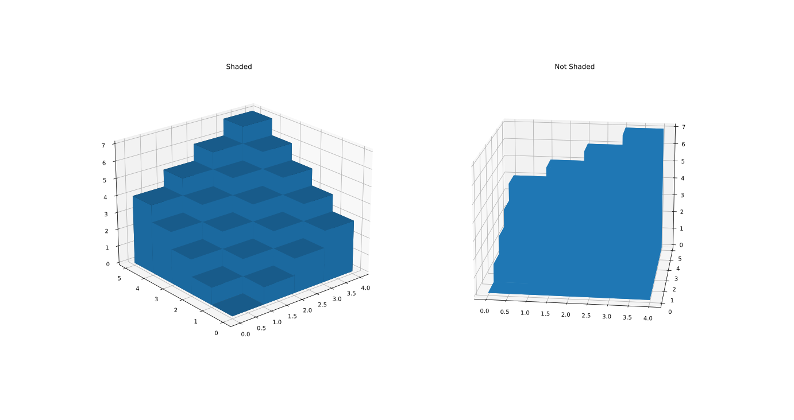

# MatPlotLib

## Tutorial 1

```python
# Date 15-06-2021

import matplotlib.pyplot as plt

plt.plot([-2, -4, -1, -2,  5,  2, -6], [-6,  0, 10,  3,  2,  0, -4])


plt.show()
```

### The above code will produce the following output

## 

---
