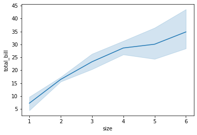
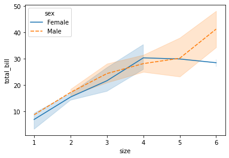
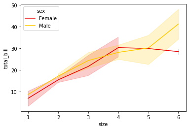
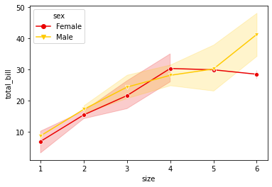
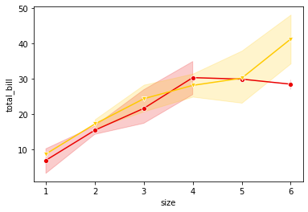
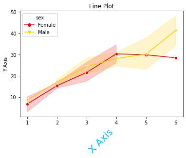
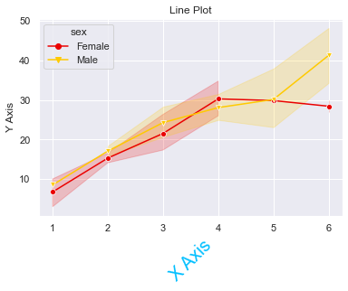
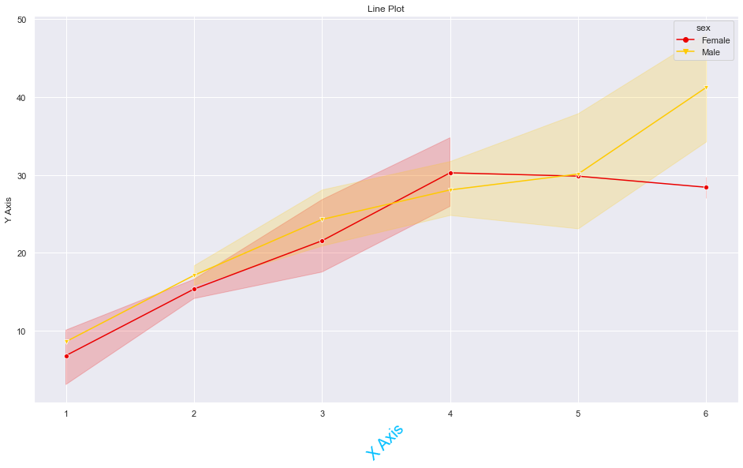
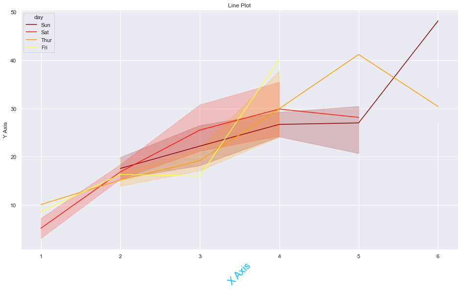

<h1 style="text-align:center; font-size:160%; font-family:verdana;color:#F44A79;"><em>Date 24-06-2021</em></h1>

<h1 style="text-align:center; font-size:360%; font-family:verdana;color:#4A3E76;"><em>More in Seaborn Line Plot</em></h1>


```python
import matplotlib.pyplot as plt
import seaborn as sns
import pandas as pd
```


```python
data=pd.read_csv('dataset_tips.csv',usecols=['total_bill','tip','size','sex','day'])
data
```


<div>
<style scoped>
    .dataframe tbody tr th:only-of-type {
        vertical-align: middle;
    }

    .dataframe tbody tr th {
        vertical-align: top;
    }

    .dataframe thead th {
        text-align: right;
    }
</style>
<table border="1" class="dataframe">
  <thead>
    <tr style="text-align: right;">
      <th></th>
      <th>total_bill</th>
      <th>tip</th>
      <th>sex</th>
      <th>day</th>
      <th>size</th>
    </tr>
  </thead>
  <tbody>
    <tr>
      <th>0</th>
      <td>16.99</td>
      <td>1.01</td>
      <td>Female</td>
      <td>Sun</td>
      <td>2</td>
    </tr>
    <tr>
      <th>1</th>
      <td>10.34</td>
      <td>1.66</td>
      <td>Male</td>
      <td>Sun</td>
      <td>3</td>
    </tr>
    <tr>
      <th>2</th>
      <td>21.01</td>
      <td>3.50</td>
      <td>Male</td>
      <td>Sun</td>
      <td>3</td>
    </tr>
    <tr>
      <th>3</th>
      <td>23.68</td>
      <td>3.31</td>
      <td>Male</td>
      <td>Sun</td>
      <td>2</td>
    </tr>
    <tr>
      <th>4</th>
      <td>24.59</td>
      <td>3.61</td>
      <td>Female</td>
      <td>Sun</td>
      <td>4</td>
    </tr>
    <tr>
      <th>...</th>
      <td>...</td>
      <td>...</td>
      <td>...</td>
      <td>...</td>
      <td>...</td>
    </tr>
    <tr>
      <th>239</th>
      <td>29.03</td>
      <td>5.92</td>
      <td>Male</td>
      <td>Sat</td>
      <td>3</td>
    </tr>
    <tr>
      <th>240</th>
      <td>27.18</td>
      <td>2.00</td>
      <td>Female</td>
      <td>Sat</td>
      <td>2</td>
    </tr>
    <tr>
      <th>241</th>
      <td>22.67</td>
      <td>2.00</td>
      <td>Male</td>
      <td>Sat</td>
      <td>2</td>
    </tr>
    <tr>
      <th>242</th>
      <td>17.82</td>
      <td>1.75</td>
      <td>Male</td>
      <td>Sat</td>
      <td>2</td>
    </tr>
    <tr>
      <th>243</th>
      <td>18.78</td>
      <td>3.00</td>
      <td>Female</td>
      <td>Thur</td>
      <td>2</td>
    </tr>
  </tbody>
</table>
<p>244 rows × 5 columns</p>
</div>


```python
sns.lineplot(x='size',y='total_bill',data=data)
```


    <AxesSubplot:xlabel='size', ylabel='total_bill'>


    

    


```python
sns.lineplot(x='size',y='total_bill',data=data,hue='sex')
```


    <AxesSubplot:xlabel='size', ylabel='total_bill'>


    

    


```python
sns.lineplot(x='size',y='total_bill',data=data,hue='sex',style='sex')
```


    <AxesSubplot:xlabel='size', ylabel='total_bill'>


    

    


```python
sns.lineplot(x='size',y='total_bill',data=data,hue='sex',style='sex',palette='hot')
```


    <AxesSubplot:xlabel='size', ylabel='total_bill'>


    

    


```python
sns.lineplot(x='size',y='total_bill',data=data,hue='sex',style='sex',palette='hot',dashes=False)
```


    <AxesSubplot:xlabel='size', ylabel='total_bill'>


    

    


```python
sns.lineplot(x='size',y='total_bill',data=data,hue='sex',style='sex',palette='hot',dashes=False,markers=['o','v'])
```


    <AxesSubplot:xlabel='size', ylabel='total_bill'>


    

    


```python
sns.lineplot(x='size',y='total_bill',data=data,hue='sex',style='sex',palette='hot',dashes=False,markers=['o','v'],legend=False)
```


    <AxesSubplot:xlabel='size', ylabel='total_bill'>


    

    


```python
sns.lineplot(x='size',y='total_bill',data=data,hue='sex',style='sex',palette='hot',dashes=False,markers=['o','v'])
plt.xlabel('X Axis',size=20,rotation=45,c='deepskyblue')
plt.ylabel('Y Axis')
plt.title('Line Plot')
```


    Text(0.5, 1.0, 'Line Plot')


    

    


```python
sns.set(style='darkgrid')
sns.lineplot(x='size',y='total_bill',data=data,hue='sex',style='sex',palette='hot',dashes=False,markers=['o','v'])
plt.xlabel('X Axis',size=20,rotation=45,c='deepskyblue')
plt.ylabel('Y Axis')
plt.title('Line Plot')
```


    Text(0.5, 1.0, 'Line Plot')


    

    


```python
plt.figure(figsize=(16,9))
sns.lineplot(x='size',y='total_bill',data=data,hue='sex',style='sex',palette='hot',dashes=False,markers=['o','v'])
plt.xlabel('X Axis',size=20,rotation=45,c='deepskyblue')
plt.ylabel('Y Axis')
plt.title('Line Plot')
```


    Text(0.5, 1.0, 'Line Plot')


    

    


```python
plt.figure(figsize=(16,9))
sns.lineplot(x='size',y='total_bill',data=data,hue='day',style='day',palette='hot',dashes=False)
plt.xlabel('X Axis',size=20,rotation=45,c='deepskyblue')
plt.ylabel('Y Axis')
plt.title('Line Plot')
```


    Text(0.5, 1.0, 'Line Plot')


    

    

